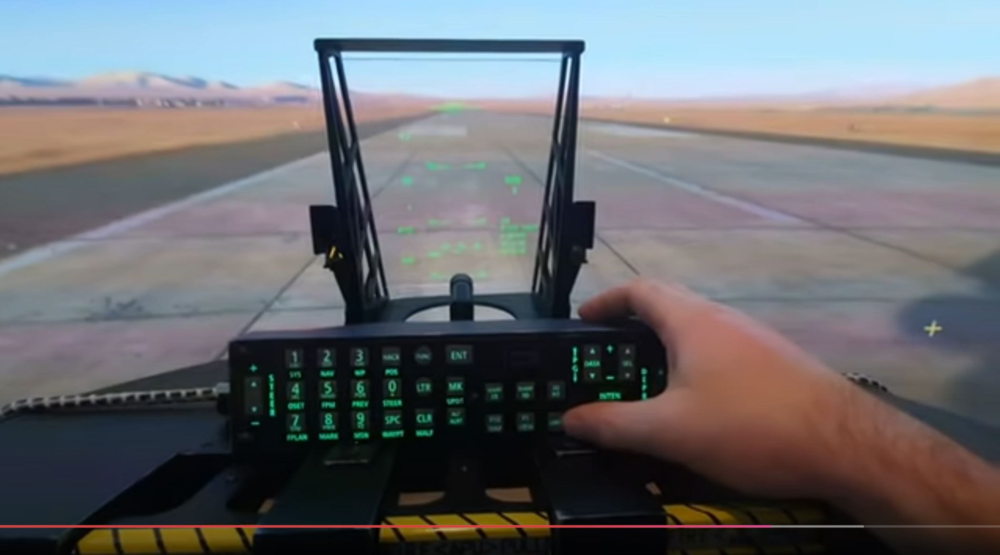
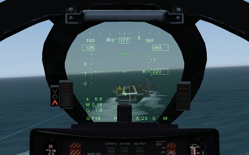
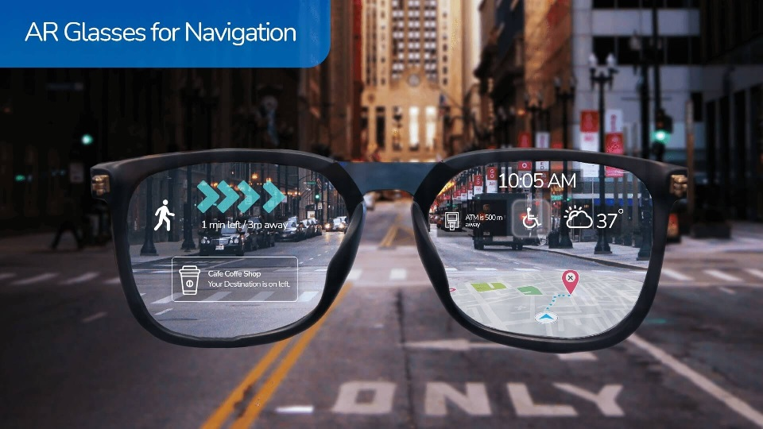
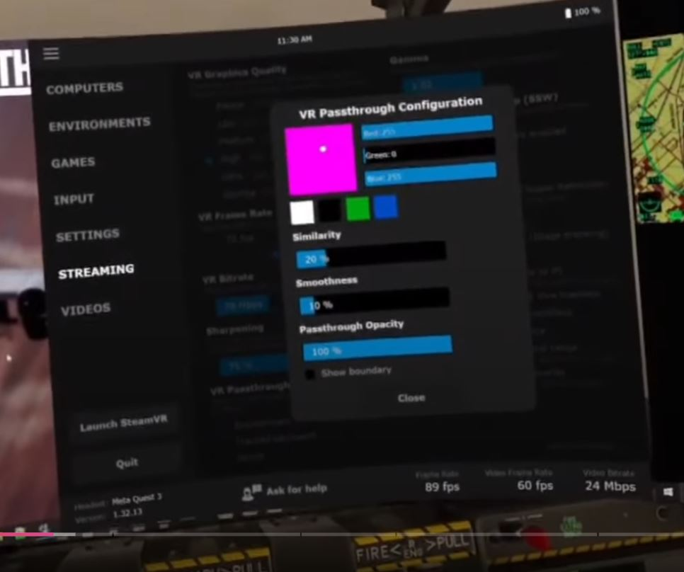
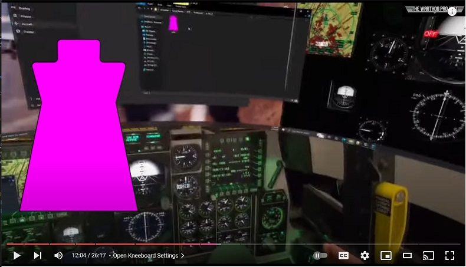

[Markdown and LaTex Cheet Sheet](https://ashki23.github.io/markdown-latex.html)  
[Markdown Cheat Sheet](https://www.markdownguide.org/basic-syntax/)  
[Markdown Embedded YT](https://stackoverflow.com/questions/11804820/how-can-i-embed-a-youtube-video-on-github-wiki-pages)  

# Research

## What is Mixed Reality (MR)?
Mixed Reality is when you have a VR Headset with forward looking cameras (ideally high quality color) that can be projected onto the VR screens of the headset for a virtual passthrough to the real world. This is called Mixed Reality Video Passthrough.
### How is that different to Augmented Reality (AR)?
AR is when you have normally transparent glasses or screen in front of you where data can be overlayed. A classic example of this is the Heads Up Display of a fighter jet where an angled piece of glass with a partially reflective coating shows a display of information that appears to hover in front of the viewer.

---
Another recent example is the availabilty of AR Navigation Glasses

## OpenXR Mixed Reality Video Passthrough
Thers are two applications that exist to make Mixed Reality work today.
Initially I was thinking of using [Virtual Desktop](https://www.vrdesktop.net/) + [OpenKneeboard](https://github.com/OpenKneeboard/OpenKneeboard) as shown by [The Warthog Project](https://www.youtube.com/@thewarthogproject) on YouTube where he has used it with his Warthog A-10 flight simulator to get Mixed Reality.

### VirtualDesktop(PC) + VirtualDesktop(Oculus)
[VirtualDesktop](https://www.vrdesktop.net/) is a way of streaming a 2D app (e.g. movie playback) or 3D game (capable of VR) to a headset. This isn't something new, Oculus and StreamVR have had their own proprietary mechanism for a long time. It is however done using OpenXR, the de-facto standard for VR now.
- VirtualDesktop is used, not only because it's OpenXR (Oculus works with OpenXR pipelines now too) but because it's the only desktop player with VR Passthrough support via a CHROMAKEY. Virtual Desktop has no built-in features to use this keying. Another application is needed to make use of the VR Passthrough feature.

    

    In this example, magenta is used because it's a very uncommon color in sim games (flight or car). 
     You can also see that the Virtual Desktop PC configuration app is a standard 2D app being prented on the normal 2D Windows desktop. In this example, Virtual Desktop has taken the Windows Desktop 2D surface and placed it as a surface (in the OpenXR layers) into the headset's 3D world.
    

### OpenKneeboard
- OpenKneeboard is an app that can put a 2D surface into a 3D pipeline. 
    - The app uses this to put assets (like flying maps) onto virual legs of pilots in flight games. 
    - If instead of placing a 2D image (eg a terrain map) in stead places the CHROMAKEY color the same value as in Virtual Desktop, it places that chromakey as a 2D surface in the 3D world. Since Virtual Desktop can use this to choose the VR world or the Real World (MR) it can be used to mask off simulator cockpits.

- Combining these two makes Goal 2 possible because you could see your steering wheel or even wider view of whatever your sim-cockpit is. If you have a full fiberglass monocoque of a F1 car implemented, you can mask at the rim of the monocoque. THIS IS MY END GOAL.

## More detail on the Mixed Reality Pipeline

Using these two applications in the OpenXR pipeline makes it possible to make a Mixed Reality environment.
In this pipeline a 3D game is sent to OpenXR over 
VirtualDesktop(PC) to [VirtualDesktop(Oculus)](https://www.meta.com/experiences/virtual-desktop/2017050365004772/) 
headset that sends back it's head location (presumably over [Oculus Platform SDK](https://developers.meta.com/horizon/downloads/package/oculus-platform-sdk/)).

In this pipline, Virtual Desktop has the ability to chromakey headset video passthrough (Mixed Reality). By setting a mask in 3D space a "hole" to the real world within the VR can be made. OpenKneeboard does this for flight games to show a pilot's let with their strapped on iPad.

In this video he has the following pipeline.

    DCS -> OpenXR -> OpenXR OpenKneeboard -> Oculus XR -> Headset

I'd like to explore this pipeline too:

    DCS -> OpenXR -> OpenXR OpenKneeboard -> VDXR(Virtual Desktop)PC -> VDXR(Virtual Desktop)Oculus Headset

OpenXR end-to-end-flow

## Here is the Warthog YouTube video:

YouTube linked image 
       Warthog Project - mixed reality in DCS
      

      
        The CHROMAKEY for the Warthog cockpit

I've just discovered (10/27/24) that the OpenXR plugin [OpenXR-MotionCompensation](https://github.com/BuzzteeBear/OpenXR-MotionCompensation) has added chroma-key Mixed Reality passthrough support in [v0.3.8.0-beta](https://github.com/BuzzteeBear/OpenXR-MotionCompensation/releases/tag/v0.3.8.0-beta), it's still using the Virtual Desktop Windows App|Oculus App to get that chromakeying over to the headset.

# Motion Compensation of a Rig.

OpenXR-MotionCompensation is needed anyhow, because it makes the simrig+vr possible by compensating for the rig emulating G-forces with motion by sending that back to the in-game virtual camera to fix the direction you're looking. For example, under hard breaking you'll be pitched forward and your head will tilt down. You want the horizon of the game to be in the middle of view. So, you need to do view[y]=view[y] - axis[surge] to remove it.

# Goal 1: 3D game in Mixed Reality (VR real world passthrough)
# Goal2 : Add a motion platform

> An Excellent Rotational Stewart Platform Reference  
> https://raw.org/research/inverse-kinematics-of-a-stewart-platform/

There are a few Stewart Platform github builds that are a good starting point.
The "grandfather" of them (ie the source of the Stewart Platform matrix operations) seems to be from this 

>[Instructables "Stewart Platform"](https://www.instructables.com/Stewart-Platform/)
In the paper, they go over the Inverse Kinematics to calculate what each Actuator's rotational position needs to be to satisfy the virtual length (Li) from each actuator axle to the platform mount point.

Here is the GitHub project I'm using as my code base
[ThomasKNR / RotaryStewartPlatform](https://github.com/ThomasKNR/RotaryStewartPlatform)

This [6DOF Rotary Stewart Platform](https://www.xsimulator.net/community/threads/compact-ac-servo-6dof-rotary-stewart-platform.14769/) is definitely a derivative work and used big 750W AC Servos + 50:1 planetary gearboxes instead of ending the implementation with the Arduino Servo class.

I think it's interesting because it is such a shallow package. Keeping the swing arms about the same length results in a ± 5-7inch swing. Depending on the radius from the center of the platform you can adjust the pitch/roll/yaw to your needs - which map to the majority of use dX,dY,dZ - ie the gravity you want to emulate vs the actual pitch|roll|traction_loss == rot(x,y,z) you may want to mimic.  
When taking telemetry from a game, you will receive 9 axis.  
> X, Y, Z, rot(x), rot(y), rot(z), dX, dY, dZ

>

#### TODO
SimulatorMotorController / SMC3
https://github.com/SimulatorMotorController/SMC3

## Goal2.1 : Add VR Motion Compensation
VR Motion Compensation OpenXR plugin has 3-4 ways it's expecting to get information about the location of the platform back to it. My understanding is that on newer headsets there are motion tracking devices that watch where the headset is in real space and relay that back. If it turns out the plugin is only getting the platform's actual position, that's easy to broadcast from the Stewart Platform controller.
In fact, the Stewart Platform with the AC Servos above, ported the ESP32-S3 BLE Server demo where it's sending out data continuously to a GATT Service for anyone to listen. I believe it's updated at 1ms/1kHz interval.  

